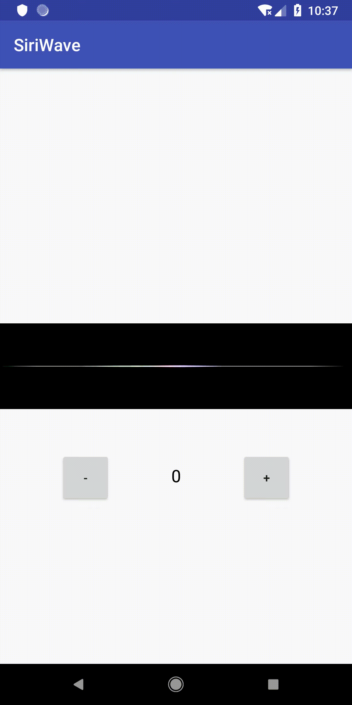

# AndroidSiriWave

在Android上实现iOS9以上的Siri 波形


## 1.运行效果



## 2.使用

### 2.1 布局

```xml
<com.kk.siriwave.SiriWaveView
        android:layout_width="0dp"
        android:layout_height="100dp"
        android:background="@android:color/black"
        android:id="@+id/siri_wave_view"
        app:layout_constraintBottom_toBottomOf="parent"
        app:layout_constraintLeft_toLeftOf="parent"
        app:layout_constraintRight_toRightOf="parent"
        app:layout_constraintTop_toTopOf="parent" />
```

背景可以自己设置，我现在用的是黑色。

### 2.2 代码

```java
siriWaveView.startAnim();
siriWaveView.setVolume(curVolume);
```

动画过程中可以随时设置音量大小

* 音量大小的值为：0到100


